# StartActivityExecution: Conflict and Reuse Policy Flowchart

```mermaid
flowchart TD
    Start["StartActivityExecution(requestID, activityID,<br/>IdReusePolicy, IdConflictPolicy)"]

    Start --> FEValidate["Frontend: validate request, resolve namespaceID,<br/>apply defaults (ConflictPolicy=FAIL, ReusePolicy=ALLOW_DUPLICATE),<br/>normalize timeouts, retry policy, search attributes"]
    FEValidate --> FEEnabled{"Standalone activity<br/>enabled for namespace?"}
    FEEnabled -->|No| ErrUnimplemented(["Unimplemented error"])
    FEEnabled -->|Yes| MapPolicies["Handler: map ActivityId{Reuse,Conflict}Policy<br/>→ CHASM BusinessID{Reuse,Conflict}Policy"]
    MapPolicies --> ChasmStart["chasm.StartExecution(key, startFn, opts)"]

    %% ── CHASM Engine: startExecution ─────────────────────────
    ChasmStart --> GetShard["getShardContext(executionRef)"]
    GetShard --> LockCurrent["lockCurrentExecution(namespaceID, activityID, archetypeID)"]
    LockCurrent --> CreateNew["createNewExecution():<br/>NewStandaloneActivity() + TransitionScheduled.Apply()<br/>→ generates dispatch + timeout tasks"]
    CreateNew --> PersistBrandNew["persistAsBrandNew():<br/>persistence.CreateWorkflowModeBrandNew"]

    PersistBrandNew --> BrandNewOK{"Success?<br/>(no current execution<br/>with this activityID)"}
    BrandNewOK -->|Yes| ReturnCreated(["Created=true, new RunID"])

    BrandNewOK -->|"No: CurrentWorkflowConditionFailedError<br/>(activity with this ID already exists)"| HandleConflict

    %% ── Request-ID dedup ──────────────────────────────────────
    HandleConflict["handleExecutionConflict()"]
    HandleConflict --> CheckRequestID{"requestID found in<br/>current execution's<br/>RequestIDs?"}

    CheckRequestID -->|Yes| ReturnDeduped(["Created=false, existing RunID<br/>(idempotent retry)"])

    %% ── Version check ─────────────────────────────────────────
    CheckRequestID -->|No| VersionCheck{"new version ≥<br/>current LastWriteVersion?"}
    VersionCheck -->|No| ErrNotActive(["NamespaceNotActive error<br/>(stale failover version)"])

    %% ── Check current execution state ─────────────────────────
    VersionCheck -->|Yes| CheckState{"Current execution state?"}

    %% ── RUNNING: apply ConflictPolicy ─────────────────────────
    CheckState -->|"RUNNING<br/>(CREATED or RUNNING)"| ConflictPolicy{"ConflictPolicy?"}

    ConflictPolicy -->|FAIL| ErrAlreadyStarted1(["ActivityExecutionAlreadyStartedError"])

    ConflictPolicy -->|USE_EXISTING| ReturnReused(["Created=false, existing RunID<br/>(use existing activity)"])

    %% Note: TERMINATE_EXISTING is not in ActivityIdConflictPolicy enum

    %% ── COMPLETED: apply ReusePolicy ──────────────────────────
    CheckState -->|COMPLETED| ReusePolicy{"ReusePolicy?"}

    ReusePolicy -->|ALLOW_DUPLICATE| CreateAsCurrent["CreateWorkflowExecution(<br/>CreateWorkflowModeUpdateCurrent)"]

    ReusePolicy -->|ALLOW_DUPLICATE_FAILED_ONLY| CheckFailedStatus{"Previous close status<br/>∈ {Failed, Canceled,<br/>Terminated, TimedOut}?"}
    CheckFailedStatus -->|Yes| CreateAsCurrent
    CheckFailedStatus -->|"No (Completed)"| ErrAlreadyStarted2(["ActivityExecutionAlreadyStartedError"])

    ReusePolicy -->|REJECT_DUPLICATE| ErrAlreadyStarted3(["ActivityExecutionAlreadyStartedError"])

    CreateAsCurrent --> ReturnCreatedReuse(["Created=true, new RunID"])

    %% ── Unexpected state ──────────────────────────────────────
    CheckState -->|Other| ErrInternal(["Internal error<br/>(unexpected state)"])

    %% ── Styling ──────────────────────────────────────────────
    classDef success fill:#d4edda,stroke:#28a745,color:#000
    classDef error fill:#f8d7da,stroke:#dc3545,color:#000
    classDef dedup fill:#fff3cd,stroke:#ffc107,color:#000
    classDef reused fill:#cce5ff,stroke:#007bff,color:#000

    class ReturnCreated,ReturnCreatedReuse success
    class ErrAlreadyStarted1,ErrAlreadyStarted2,ErrAlreadyStarted3,ErrInternal,ErrNotActive,ErrUnimplemented error
    class ReturnDeduped dedup
    class ReturnReused reused
```

## Legend

| Color | Meaning |
|-------|---------|
| Green | New activity created (`Created=true`) |
| Blue | Existing activity reused (`Created=false`, `UseExisting`) |
| Yellow | Request-ID dedup (idempotent retry) |
| Red | Error returned to caller |

## Key Differences from StartWorkflowExecution

| Aspect | StartWorkflowExecution | StartActivityExecution |
|--------|----------------------|----------------------|
| Framework | OSS workflow engine | CHASM engine |
| Persistence model | History events + mutable state | CHASM nodes (no history events) |
| ConflictPolicy values | `FAIL`, `USE_EXISTING`, `TERMINATE_EXISTING` | `FAIL`, `USE_EXISTING` only |
| MinimalReuseInterval | Yes (throttles rapid restarts) | No |
| Request-ID dedup | Checks EventType to distinguish start vs other events | Simple presence check in RequestIDs map |
| USE_EXISTING behavior | Can attach requestID, callbacks, links via `OnConflictOptions` | Returns existing run reference (no attachment options yet) |
| TERMINATE_EXISTING | Supported (terminate + create in one transaction) | Not supported (`Unimplemented` if attempted internally) |
| Post-create side effects | History events written; transfer tasks for Matching | `TransitionScheduled` generates `ActivityDispatchTask` (push to Matching) + timeout tasks |

## Key Implementation References

- Frontend handler: `chasm/lib/activity/frontend.go:84-105`
- History handler: `chasm/lib/activity/handler.go:51-104`
- CHASM engine StartExecution: `service/history/chasm_engine.go:111-202`
- Conflict policy handling: `service/history/chasm_engine.go:950-997`
- Reuse policy handling: `service/history/chasm_engine.go:999-1064`
- Policy enums: `api/temporal/api/enums/v1/activity.proto:59-81`
- Default policies: `chasm/lib/activity/validator.go:211-221` — `ConflictPolicy=FAIL`, `ReusePolicy=ALLOW_DUPLICATE`
- `FailedWorkflowStatuses` = {Failed, Canceled, Terminated, TimedOut} — reused from `service/history/consts/const.go:131-136`
- `NewStandaloneActivity` + `TransitionScheduled`: `chasm/lib/activity/activity.go` and `chasm/lib/activity/statemachine.go`
