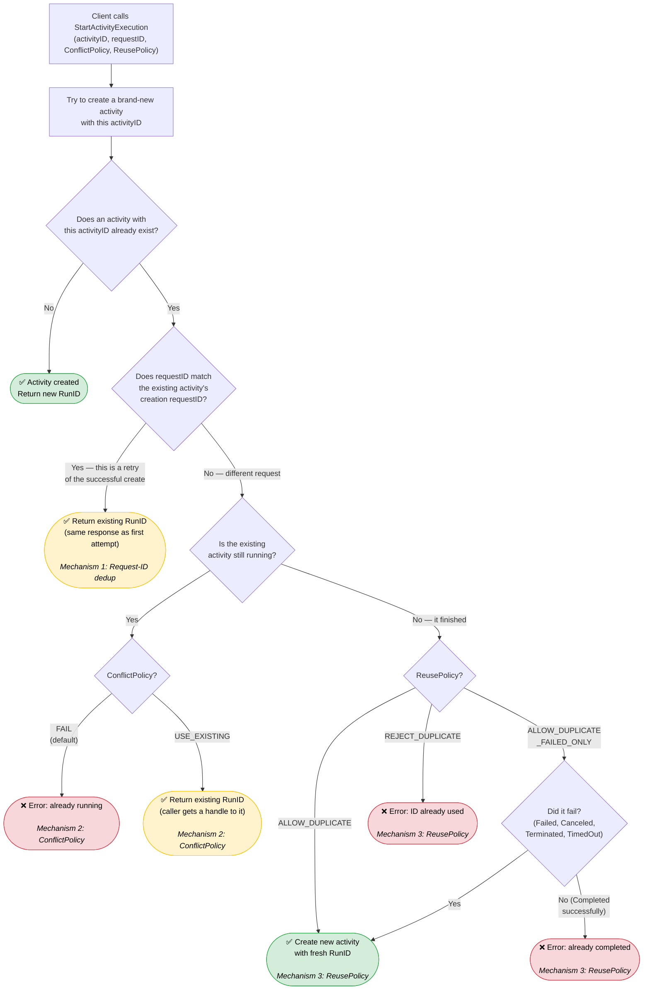

# Idempotency in StartActivityExecution

## The Problem

A client wants to start an activity with a specific **Activity ID** (a user-chosen business
identifier like `"send-invoice-12345"`). But networks are unreliable: the request might time out
after the server processed it, causing the client to retry. Or, completely independently, two
different parts of the system might legitimately try to start an activity with the same ID.

The server must handle all of this correctly. There are three distinct mechanisms at play, each
solving a different problem.

## The Three Mechanisms

## Why Each Mechanism Exists

### Mechanism 1: Request-ID Dedup — "Was this the same request?"

Every request carries a client-generated **Request ID** (a UUID). If the server sees the same
Request ID on a creation attempt as the one that originally created the existing activity, it knows
this is a **retry of the same logical operation** — not a new one. It returns the same response it
would have returned originally.

This is classic **at-most-once** semantics via idempotency keys. Without it, a network timeout on a
successful create would force the client to either (a) give up, not knowing if it succeeded, or (b)
retry and risk a confusing error about the activity already existing.

Note that only **successful** creation stores the Request ID. If a start attempt is rejected by
ConflictPolicy or ReusePolicy, the Request ID is never persisted — there is nothing to deduplicate,
since the server never acted on the request. A retry with the same Request ID simply hits the same
policy check again.

### Mechanism 2: ConflictPolicy — "What if it's already running?"

If the Request ID doesn't match, this is genuinely a **different request** that happens to use the
same Activity ID, and the existing activity is still running. The caller chooses:

- **FAIL** (default): Reject. Two concurrent instances of the same logical activity are not allowed.
- **USE_EXISTING**: Don't start a new one; return a reference to the running one. Useful when
  multiple callers want to ensure "exactly one instance of X is running" without caring who started
  it.

### Mechanism 3: ReusePolicy — "What if it already finished?"

If the existing activity has already completed, the question is whether the Activity ID can be
recycled. The caller chooses:

- **ALLOW_DUPLICATE**: Always allow reuse. The old run and new run coexist (distinguished by their
  **Run IDs**).
- **ALLOW_DUPLICATE_FAILED_ONLY**: Allow reuse only if the previous run failed. This prevents
  accidentally re-executing work that already succeeded.
- **REJECT_DUPLICATE**: Never allow reuse. The Activity ID is consumed forever.

## The Two Kinds of ID

| ID | Who chooses it | What it identifies | Cardinality |
|----|---------------|-------------------|-------------|
| **Activity ID** | The caller (business logic) | A logical unit of work (e.g. `"send-invoice-12345"`) | One per logical operation |
| **Run ID** | The server (UUID) | A specific execution attempt | Many per Activity ID (if reuse is allowed) |

The Activity ID is how the *business* thinks about the work. The Run ID is how the *system*
distinguishes multiple attempts. Together with the Request ID (for retry dedup), they give the
caller precise control over idempotency semantics.

## Note: UseExisting Does Not Store the Request ID

Consider this scenario:
1. First request `(activityID=A, requestID=R, ConflictPolicy=UseExisting)` arrives. Activity A is
   already running. The server returns the existing RunID via the UseExisting path.
2. Identical second request `(activityID=A, requestID=R, ConflictPolicy=UseExisting)` arrives.
   Activity A is still running.

Is the second request dedup'd via Request ID, or does it go through UseExisting again?

**It goes through UseExisting again.** The UseExisting path performs no persistence write — it reads
the existing execution's RunID and returns it. It never adds `R` to the existing execution's
`RequestIDs` map. So when the second request checks `R ∈ currentExecution.RequestIDs`, it doesn't
match (the map only contains the Request ID that *created* the execution). The request falls through
to the normal policy evaluation and hits UseExisting a second time.

Both requests produce the same observable result (`Created=false`, existing RunID), but via the
policy path, not the dedup path. This is a consequence of a general principle: **only operations
that mutate the execution persist the Request ID.** UseExisting is a read-only operation on the
existing execution, so it leaves no trace for future dedup.
