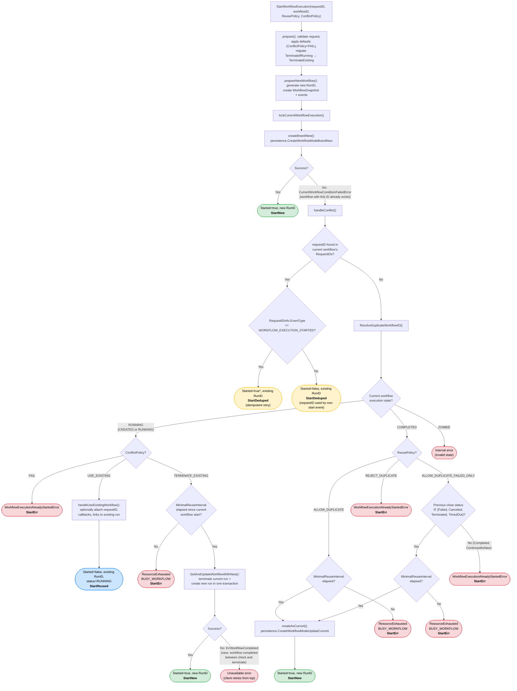

# StartWorkflowExecution: Conflict and Reuse Policy Flowchart

## Legend

| Color | Meaning |
|-------|---------|
| Green | New workflow created (`Started=true`) |
| Blue | Existing workflow reused (`Started=false`, `UseExisting`) |
| Yellow | Request-ID dedup (idempotent retry) |
| Red | Error returned to caller |

## Key Implementation References

- Policy resolution: `service/history/api/workflow_id_dedup.go`
- Starter orchestration: `service/history/api/startworkflow/api.go`
- `FailedWorkflowStatuses` = {Failed, Canceled, Terminated, TimedOut} — defined in `service/history/consts/const.go:131-136`
- `MinimalReuseInterval`: dynamic config per namespace; prevents rapid sequential starts of the same workflow ID
- Default `ConflictPolicy` = `FAIL` (applied in `prepare()` if unset)
- Deprecated `ReusePolicy=TerminateIfRunning` is migrated to `ConflictPolicy=TerminateExisting` + `ReusePolicy=AllowDuplicate` before any policy evaluation
