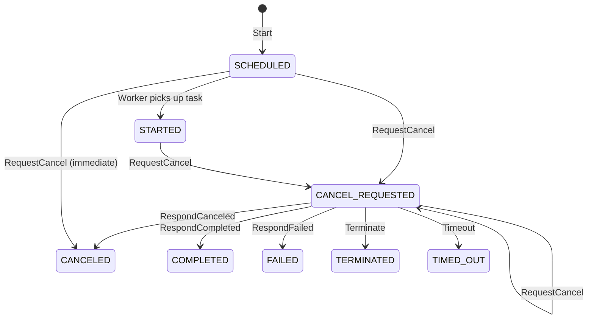
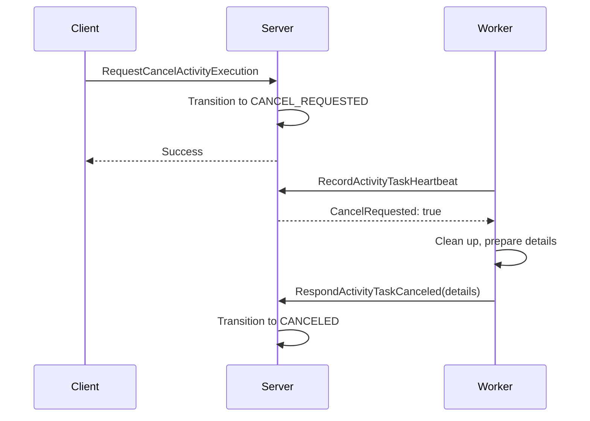

# Standalone Activity Cancellation

Standalone activities support cooperative cancellation, allowing external callers to request that a running activity be canceled. The activity worker must acknowledge the cancellation request and explicitly respond to complete the cancellation.

## State Machine

Cancellation involves the `CANCEL_REQUESTED` intermediate state:



> **Note**: When in `CANCEL_REQUESTED`, the activity remains running. The worker is notified via heartbeat response.

## Cancellation Flow

### When Activity is STARTED (Running)

1. **Request cancellation**: External caller invokes `RequestCancelActivityExecution`
2. **State transition**: Activity transitions from `STARTED` → `CANCEL_REQUESTED`
3. **Worker notification**: Worker discovers cancellation via heartbeat response (`CancelRequested: true`)
4. **Worker acknowledgment**: Worker calls `RespondActivityTaskCanceled` with optional details
5. **Final state**: Activity transitions to `CANCELED`



### When Activity is SCHEDULED (Not Yet Running)

If cancellation is requested while the activity is still in `SCHEDULED` state (no worker has picked it up), the activity is **immediately canceled**:

1. **Request cancellation**: External caller invokes `RequestCancelActivityExecution`
2. **Immediate transition**: Activity transitions `SCHEDULED` → `CANCEL_REQUESTED` → `CANCELED`
3. **Outcome**: The cancellation reason is stored as the canceled failure details

https://github.com/temporalio/temporal/blob/main/chasm/lib/activity/activity.go

[`chasm/lib/activity/activity.go` (`Activity.handleCancellationRequested`)](https://github.com/temporalio/temporal/blob/main/chasm/lib/activity/activity.go#L293-L330)
```go
func (a *Activity) handleCancellationRequested(ctx chasm.MutableContext, req *activitypb.RequestCancelActivityExecutionRequest) (
	*activitypb.RequestCancelActivityExecutionResponse, error,
) {
	// ... request ID validation ...

	// If in scheduled state, cancel immediately right after marking cancel requested
	isCancelImmediately := a.GetStatus() == activitypb.ACTIVITY_EXECUTION_STATUS_SCHEDULED

	if err := TransitionCancelRequested.Apply(a, ctx, req.GetFrontendRequest()); err != nil {
		return nil, err
	}

	if isCancelImmediately {
		details := &commonpb.Payloads{
			Payloads: []*commonpb.Payload{
				payload.EncodeString(req.GetFrontendRequest().GetReason()),
			},
		}

		err := TransitionCanceled.Apply(a, ctx, details)
		if err != nil {
			return nil, err
		}
	}

	return &activitypb.RequestCancelActivityExecutionResponse{}, nil
}
```

## Worker Detection via Heartbeat

Workers detect pending cancellation through the heartbeat response:

[`chasm/lib/activity/activity.go` (`Activity.RecordHeartbeat`)](https://github.com/temporalio/temporal/blob/main/chasm/lib/activity/activity.go#L453-L478)
```go
func (a *Activity) RecordHeartbeat(
	ctx chasm.MutableContext,
	input WithToken[*historyservice.RecordActivityTaskHeartbeatRequest],
) (*historyservice.RecordActivityTaskHeartbeatResponse, error) {
	// ... validation and heartbeat recording ...

	return &historyservice.RecordActivityTaskHeartbeatResponse{
		CancelRequested: a.Status == activitypb.ACTIVITY_EXECUTION_STATUS_CANCEL_REQUESTED,
	}, nil
}
```

## Cooperative Cancellation

After `CANCEL_REQUESTED`, the activity can still complete in several ways:

| Outcome | Worker Action | Final Status |
|---------|---------------|--------------|
| Honor cancellation | `RespondActivityTaskCanceled` | `CANCELED` |
| Complete successfully | `RespondActivityTaskCompleted` | `COMPLETED` |
| Fail | `RespondActivityTaskFailed` | `FAILED` |
| External termination | `TerminateActivityExecution` | `TERMINATED` |
| Timeout | (automatic) | `TIMED_OUT` |

This allows workers to finish critical work before acknowledging cancellation.

## Idempotency

Cancellation requests are idempotent based on `RequestId`:

- **Same RequestId**: Second request is a no-op, returns success
- **Different RequestId**: Returns `FailedPrecondition` error

[`chasm/lib/activity/activity.go` (`Activity.handleCancellationRequested`)](https://github.com/temporalio/temporal/blob/main/chasm/lib/activity/activity.go#L296-L307)
```go
newReqID := req.GetFrontendRequest().GetRequestId()
existingReqID := a.GetCancelState().GetRequestId()

// If already in cancel requested state, fail if request ID is different, else no-op
if a.GetStatus() == activitypb.ACTIVITY_EXECUTION_STATUS_CANCEL_REQUESTED {
	if existingReqID != newReqID {
		return nil, serviceerror.NewFailedPrecondition(
			fmt.Sprintf("cancellation already requested with request ID %s", existingReqID))
	}

	return &activitypb.RequestCancelActivityExecutionResponse{}, nil
}
```

## Cancellation State

When cancellation is requested, the cancel state is recorded:

[`chasm/lib/activity/proto/v1/activity_state.proto`](https://github.com/temporalio/temporal/blob/main/chasm/lib/activity/proto/v1/activity_state.proto#L101-L106)
```protobuf
message ActivityCancelState {
    string request_id = 1;
    google.protobuf.Timestamp request_time = 2;
    string identity = 3;
    string reason = 4;
}
```

This allows:
- Tracking who requested cancellation and when
- Providing a reason that can be inspected via `DescribeActivityExecution`
- Enforcing request ID idempotency

## API Reference

### RequestCancelActivityExecution

Request cancellation of a standalone activity:

```go
_, err := client.RequestCancelActivityExecution(ctx, &workflowservice.RequestCancelActivityExecutionRequest{
    Namespace:  "my-namespace",
    ActivityId: "my-activity-id",
    RunId:      "activity-run-id",  // optional, targets latest if omitted
    Identity:   "my-service",
    RequestId:  "unique-request-id", // for idempotency
    Reason:     "user requested cancellation",
})
```

### RespondActivityTaskCanceled

Worker acknowledges cancellation:

```go
_, err := client.RespondActivityTaskCanceled(ctx, &workflowservice.RespondActivityTaskCanceledRequest{
    Namespace: "my-namespace",
    TaskToken: taskToken,
    Details:   cancelationDetails, // optional payload
    Identity:  "worker-id",
})
```

## Cancellation vs Termination

| Aspect | Cancellation | Termination |
|--------|--------------|-------------|
| Cooperative | Yes - worker must acknowledge | No - immediate |
| Worker notification | Via heartbeat | None (server-side only) |
| Worker can complete normally | Yes | No |
| Cleanup opportunity | Yes | No |
| Use case | Graceful shutdown | Force stop |

